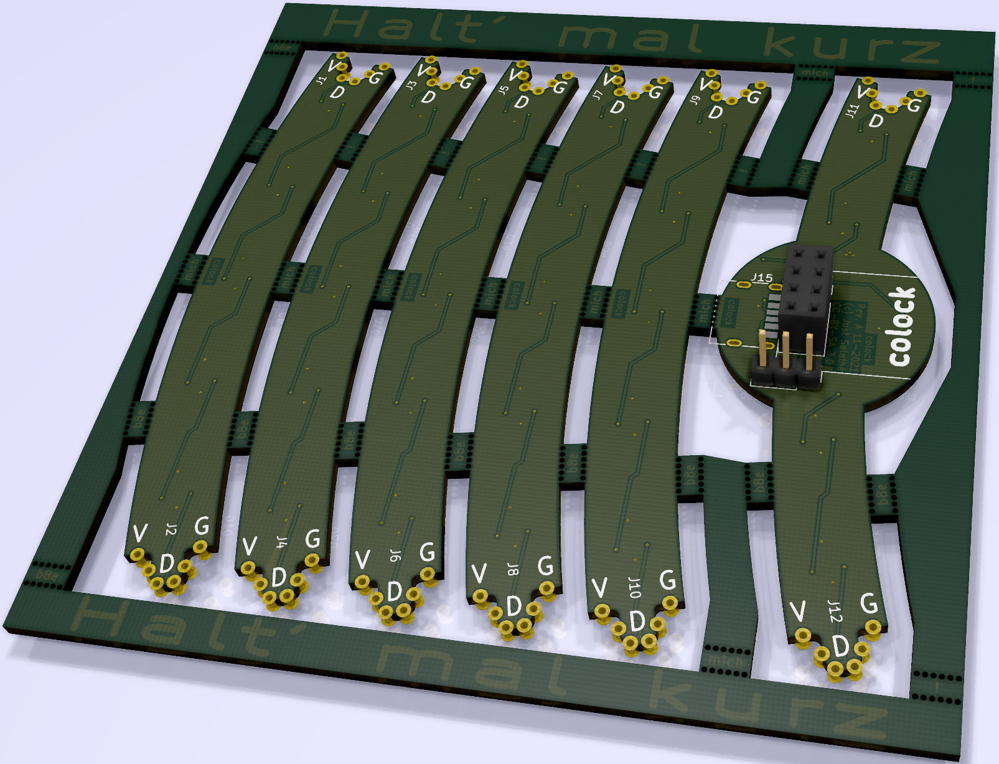
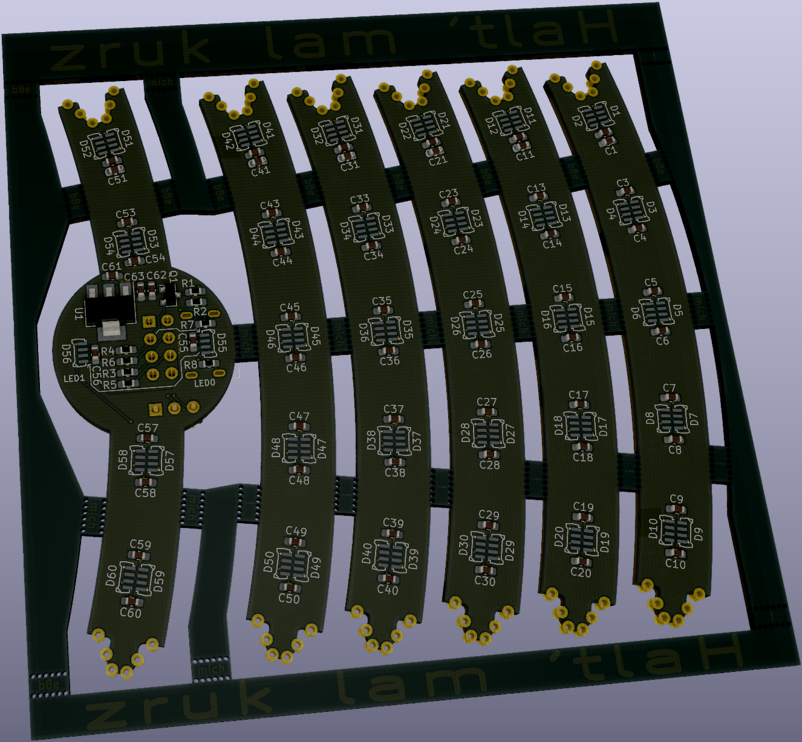

# Colock
A USB powered RGB wall clock inspired by analog clocks

## Parts

| Part | Count | Refs | JLCPCB # ***extended*** |
| --- | --- | --- | --- |
| 100nF | 61 | C1...60, C63 | C14663 |
| 10uF | 2 | C61, C62 | C19702 |
| WS2812B-4020 | 60 | LED1...60 | ***C965557*** |
| TYPE-C-31-M-17 | 1 | J15 | ***C283540*** |
| AO3400A | 1 | Q1 | C20917 |
| 0R | 1 | R1 | C21189 |
| 2k2 | 1 | R2 | C4190 |
| 10k | 4 | R3...6 | C25804 |
| 5k1 | 2 | R7, R8 | C23186 |
| AMS1117-3.3 | 1 | U1 | C6186 |

## Assembly

You need two panels with one main segment and five LED segments each to for a full circle by soldering all those segments together.

The panels should look a little something like this (don't mind the missing 3D models):

One of the two main segments needs to get the USB-C socket, (optionally the UART header) as well as the ESP-01 Pin-Socket added and the 0 Ohm link R1 removed (if ordered with populated SMD components).

The other main segment may benefit from removing the pullup resistor R2 and the level shifting MOSFET Q1.
